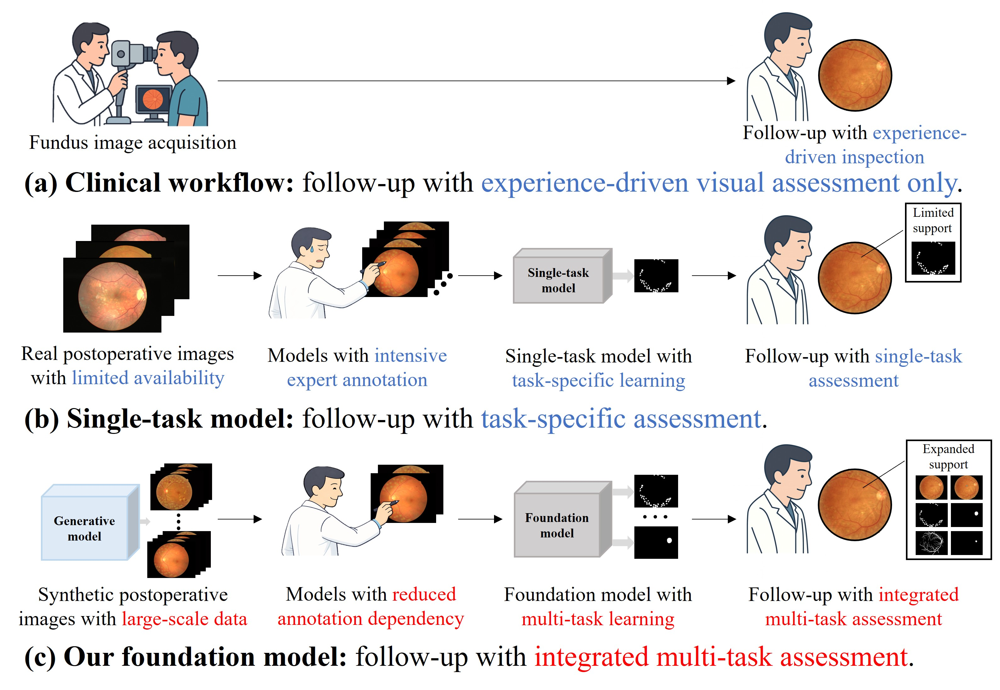
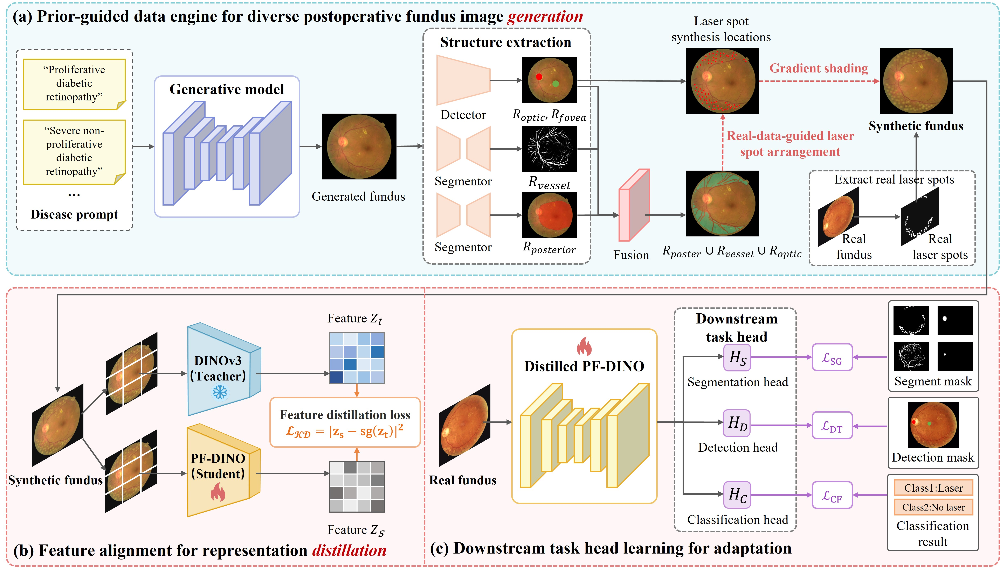

# A Generation–Distillation Foundation Model for Post-Photocoagulation Fundus Images

---

**PostGD** is a **Generation–Distillation Foundation Model** designed for  
**post-photocoagulation fundus image analysis**.

It integrates **prior-guided postoperative image synthesis** with **foundation-level representation distillation** to learn **robust and transferable postoperative representations** under **extremely limited annotations**, supporting dense and semantic follow-up tasks such as **segmentation, localization, and classification**.

> 📌 **Note**: The accompanying manuscript is currently *under review*.  
> A public preprint and project page will be released upon acceptance.

---

## ✨ Highlights

> **PostGD** — A generation–distillation paradigm that bridges **clinically constrained synthesis** and **foundation model distillation** for objective postoperative fundus follow-up.

- 🧬 Prior-guided synthesis with anatomical & therapeutic constraints  
- 🧠 Foundation distillation from a frozen teacher to a lightweight student  
- 🧩 Unified multi-task adaptation for postoperative analysis  
- 📈 Strong performance under few-shot / low-label regimes  

---

## 🧭 1. Motivation: From Experience-driven to Foundation-based Follow-up

Conventional post-photocoagulation follow-up relies heavily on **subjective visual inspection** by clinicians.  
PostGD enables **structured representations and quantitative measurements**, facilitating **objective and reproducible** postoperative assessment.

  
   
  <em>PostGD transforms experience-driven follow-up into foundation-based representation learning.</em>

---

## 🌀 2. Prior-Guided Postoperative Data Engine

Instead of naive synthesis, **PostGD enforces clinically valid constraints** during postoperative data generation, integrating anatomical structures and therapeutic patterns to ensure realism and clinical plausibility.

- **Anatomical priors**: optic disc/cup, macula, vessels  
- **Therapeutic priors**: laser spot placement and spatial distribution  
- **Visual realism**: foundation-generated backgrounds with constrained spot synthesis  

  
   
  <em>Overview of the PostGD framework: prior-guided postoperative data generation, foundation distillation, and multi-task adaptation.</em>

---

## 🔥 3. Foundation Distillation for Postoperative Representation Learning

Built upon the prior-guided synthetic data, PostGD distills **structural and semantic priors** from a frozen foundation teacher into a compact student backbone.  
As illustrated in the pipeline above, large-scale synthetic postoperative images are used to align synthetic and real representations under extremely limited supervision.

This design enables:
- Stable representation learning with scarce real annotations  
- Efficient downstream adaptation  
- Lightweight and deployable models  

---

## 🧩 4. Multi-task Adaptation

On top of the distilled backbone, PostGD supports **multiple postoperative follow-up tasks** via lightweight task-specific heads, as shown in the unified framework above:

- **Segmentation**: laser scars, vessels, optic disc/cup  
- **Localization**: fovea and optic disc center  
- **Classification**: postoperative outcomes  

This shared-backbone design allows knowledge transfer across tasks while maintaining efficiency.

---

